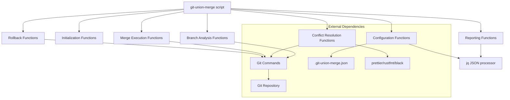

# Design Document

## Overview

The Git Union Merge CLI tool is a bash script that performs atomic merges of multiple feature branches into the main branch. The system leverages native Git commands and standard Unix utilities to provide intelligent conflict resolution, comprehensive preview capabilities, and atomic rollback functionality.

The core innovation lies in the efficient use of Git's built-in merge-tree and worktree capabilities, enabling O(N) time complexity for N branches while maintaining high accuracy in automated conflict resolution through shell scripting and external tool integration.

## Architecture

### System Components



### Script Architecture

The main script orchestrates all operations through a functional approach:

1. **Initialization Phase**: Repository validation, configuration loading via jq
2. **Analysis Phase**: Branch discovery via git commands, conflict detection via git merge-tree
3. **Preview Phase**: Report generation, user confirmation prompts
4. **Execution Phase**: Checkpoint creation, merge execution via git worktree, validation
5. **Cleanup Phase**: Branch cleanup, tagging via git tag, final verification

## Components and Interfaces

### 1. Main Script Structure

**Responsibility**: Command parsing, user interaction, output formatting

```bash
#!/bin/bash
# Main command structure
main() {
    parse_arguments "$@"
    validate_repository
    load_configuration
    execute_command
}

# Command parsing with getopts
parse_arguments() {
    while getopts "hdxrc:v" opt; do
        case $opt in
            h) show_help ;;
            d) DRY_RUN=true ;;
            x) EXECUTE=true ;;
            r) ROLLBACK=true ;;
            c) CONFIG_FILE="$OPTARG" ;;
            v) VERBOSE=true ;;
        esac
    done
}
```

**Key Functions**:
- `parse_arguments()` - Command line argument parsing with getopts
- `execute_command()` - Main command dispatcher based on flags
- `display_report()` - Formatted output rendering with JSON support

### 2. Branch Analysis Functions

**Responsibility**: Branch discovery, metadata extraction, conflict detection

```bash
# Branch discovery and filtering
discover_branches() {
    local include_patterns="$1"
    local exclude_patterns="$2"
    
    git branch -a --format='%(refname:short)' | \
        grep -E "$include_patterns" | \
        grep -vE "$exclude_patterns" | \
        grep -v "^origin/HEAD"
}

# Branch metadata extraction
get_branch_info() {
    local branch="$1"
    local commit_sha=$(git rev-parse "$branch")
    local commit_count=$(git rev-list --count "$branch" ^main)
    local modified_files=$(git diff --name-only main.."$branch")
    
    echo "$branch|$commit_sha|$commit_count|$modified_files"
}
```

**Key Functions**:
- `discover_branches()` - Identify mergeable branches using grep patterns
- `analyze_conflicts()` - Conflict detection using git merge-tree
- `estimate_merge_time()` - Performance prediction based on branch complexity

### 3. Conflict Resolution Functions

**Responsibility**: Automated conflict resolution, strategy selection

```bash
# Conflict type detection
detect_conflict_type() {
    local file="$1"
    local branch1="$2"
    local branch2="$3"
    
    # Check for whitespace-only conflicts
    if git diff --ignore-space-change "$branch1" "$branch2" -- "$file" | grep -q "^[+-]"; then
        echo "WHITESPACE_ONLY"
    elif has_overlapping_changes "$file" "$branch1" "$branch2"; then
        echo "OVERLAPPING_LOGIC"
    else
        echo "NON_OVERLAPPING"
    fi
}

# Auto-resolution strategies
resolve_whitespace_conflict() {
    local file="$1"
    local formatter=$(get_formatter_for_file "$file")
    
    if [[ -n "$formatter" ]]; then
        $formatter "$file" && validate_syntax "$file"
    fi
}
```

**Resolution Strategies**:
- **Whitespace Resolution**: Uses project formatters (prettier, rustfmt, black)
- **Non-overlapping Merge**: Intelligent merge with syntax validation
- **Deduplication**: Identical change detection and removal
- **File-type Strategies**: Per-file-type merge policies from config

### 4. Merge Execution Functions

**Responsibility**: Atomic merge execution, history preservation

```bash
# Checkpoint creation
create_checkpoint() {
    local checkpoint_id="union-merge-$(date +%Y%m%d-%H%M%S)"
    local checkpoint_dir=".git/union-merge-checkpoints/$checkpoint_id"
    
    mkdir -p "$checkpoint_dir"
    git rev-parse HEAD > "$checkpoint_dir/head_sha"
    git branch -a > "$checkpoint_dir/branch_refs"
    git stash list > "$checkpoint_dir/stash_state"
    
    echo "$checkpoint_id"
}

# Atomic merge execution
execute_merge() {
    local branches=("$@")
    local worktree_dir=$(mktemp -d)
    
    # Use git worktree for atomic operations
    git worktree add "$worktree_dir" main
    cd "$worktree_dir"
    
    # Merge all branches
    for branch in "${branches[@]}"; do
        git merge --no-ff "$branch" || handle_merge_failure "$branch"
    done
    
    # Create final merge commit
    create_union_merge_commit "${branches[@]}"
}
```

**Key Functions**:
- `create_checkpoint()` - Pre-merge state capture in .git directory
- `execute_merge()` - Atomic merge using git worktree
- `create_union_merge_commit()` - Multi-parent commit with detailed message
- `apply_tags()` - Timestamped tag creation

### 5. Configuration Management Functions

**Responsibility**: Configuration loading, validation, defaults

```bash
# Configuration loading with jq
load_configuration() {
    local config_file="${CONFIG_FILE:-.git-union-merge.json}"
    
    if [[ -f "$config_file" ]]; then
        INCLUDE_PATTERNS=$(jq -r '.branch_filters.include[]' "$config_file" | tr '\n' '|')
        EXCLUDE_PATTERNS=$(jq -r '.branch_filters.exclude[]' "$config_file" | tr '\n' '|')
        MERGE_STRATEGIES=$(jq -r '.merge_strategies' "$config_file")
    else
        use_default_configuration
    fi
}

# Default configuration
use_default_configuration() {
    INCLUDE_PATTERNS="feature/*|bugfix/*"
    EXCLUDE_PATTERNS="release/*|hotfix/*|main|master|develop"
    AUTO_RESOLVE_WHITESPACE=true
}
```

**Configuration Schema**:
```json
{
  "branch_filters": {
    "include": ["feature/*", "bugfix/*"],
    "exclude": ["release/*", "hotfix/*"]
  },
  "merge_strategies": {
    "*.lock": "ours",
    "*.json": "recursive",
    "*.md": "union"
  },
  "conflict_resolution": {
    "auto_resolve_whitespace": true,
    "syntax_validation": true,
    "formatter_command": "prettier --write"
  }
}
```

## Data Models

### Core Data Structures (Bash Variables and Files)

```bash
# Repository state variables
REPOSITORY_PATH="$(pwd)"
MAIN_BRANCH="main"
BRANCHES=()
CONFIG_FILE=".git-union-merge.json"

# Branch information (pipe-delimited format)
# Format: "branch_name|commit_sha|commit_count|modified_files"
BRANCH_INFO=()

# Conflict information (JSON format for complex data)
CONFLICT_INFO='[
  {
    "file_path": "src/main.js",
    "conflict_type": "WHITESPACE_ONLY",
    "line_ranges": [[10, 15], [25, 30]],
    "branches_involved": ["feature/auth", "feature/ui"],
    "resolution_strategy": "auto_format"
  }
]'

# Merge report (JSON format)
MERGE_REPORT='{
  "timestamp": "2024-01-15T10:30:00Z",
  "branch_count": 5,
  "file_modifications": 23,
  "conflicts_detected": 8,
  "conflicts_auto_resolved": 6,
  "estimated_time": "25s",
  "conflicts": []
}'

# Checkpoint data (stored in files)
CHECKPOINT_DIR=".git/union-merge-checkpoints"
# Files: head_sha, branch_refs, stash_state, timestamp
```

### Git Integration Functions

```bash
# Git operation wrappers
get_branches() {
    git branch -a --format='%(refname:short)' | \
        grep -vE "^(main|master|develop|origin/HEAD)$"
}

get_commit_info() {
    local branch="$1"
    git log -1 --format="%H|%an|%ae|%at|%s" "$branch"
}

detect_conflicts() {
    local branch1="$1"
    local branch2="$2"
    git merge-tree "$(git merge-base "$branch1" "$branch2")" "$branch1" "$branch2"
}

create_merge_commit() {
    local branches=("$@")
    local message="Union merge of branches: ${branches[*]}"
    git commit --allow-empty -m "$message"
}

create_tag() {
    local tag_name="$1"
    local commit_sha="$2"
    git tag "$tag_name" "$commit_sha"
}

reset_to_commit() {
    local commit_sha="$1"
    git reset --hard "$commit_sha"
}
```

## Error Handling

### Error Categories and Exit Codes

```bash
# Error codes
readonly EXIT_SUCCESS=0
readonly EXIT_GENERAL_ERROR=1
readonly EXIT_GIT_ERROR=2
readonly EXIT_CONFIG_ERROR=3
readonly EXIT_CONFLICT_ERROR=4
readonly EXIT_CHECKPOINT_ERROR=5
readonly EXIT_VALIDATION_ERROR=6

# Error handling functions
handle_git_error() {
    local error_msg="$1"
    log_error "Git operation failed: $error_msg"
    cleanup_temp_files
    exit $EXIT_GIT_ERROR
}

handle_conflict_error() {
    local file="$1"
    local error_msg="$2"
    log_error "Conflict resolution failed for $file: $error_msg"
    
    # Generate recovery suggestions
    echo "Recovery suggestions:" >&2
    echo "1. Manually resolve conflicts in $file" >&2
    echo "2. Run 'git union-merge --rollback' to restore previous state" >&2
    echo "3. Exclude problematic branches with configuration" >&2
    
    exit $EXIT_CONFLICT_ERROR
}

# Error reporting with JSON output
report_error() {
    local error_type="$1"
    local error_msg="$2"
    local suggestions="$3"
    
    if [[ "$OUTPUT_FORMAT" == "json" ]]; then
        jq -n \
            --arg type "$error_type" \
            --arg message "$error_msg" \
            --arg suggestions "$suggestions" \
            '{error: {type: $type, message: $message, suggestions: $suggestions}}'
    else
        echo "ERROR [$error_type]: $error_msg" >&2
        [[ -n "$suggestions" ]] && echo "Suggestions: $suggestions" >&2
    fi
}
```

### Error Recovery Strategies

1. **Transactional Operations**: All merge operations use git worktree for atomic behavior
2. **Graceful Degradation**: Continue processing remaining branches on single branch failure
3. **Detailed Error Reporting**: Structured JSON error reports with recovery suggestions
4. **State Preservation**: Maintain checkpoints in .git directory for manual recovery
5. **Cleanup Functions**: Automatic cleanup of temporary files and worktrees on failure

## Testing Strategy

### Unit Testing

- **Component Isolation**: Mock Git interface for deterministic testing
- **Conflict Resolution**: Comprehensive test cases for each resolution strategy
- **Configuration Validation**: Edge cases and malformed configuration handling
- **Performance Testing**: Benchmark O(N) complexity with varying branch counts

### Integration Testing

- **Real Repository Testing**: Test with actual Git repositories of varying complexity
- **Cross-Platform Validation**: Linux, macOS, Windows compatibility
- **Git Version Compatibility**: Support for Git 2.20+ versions
- **Formatter Integration**: Test with popular formatters (prettier, rustfmt, black)

### End-to-End Testing

- **Workflow Scenarios**: Complete merge workflows with rollback testing
- **Stress Testing**: Large repositories with 50+ branches
- **Failure Scenarios**: Network failures, disk space, permission issues
- **Recovery Testing**: Checkpoint restoration and manual recovery procedures

### Performance Benchmarks

- **Target Metrics**:
  - 5-20 branches: < 30 seconds total execution
  - Conflict detection: < 5 seconds per branch pair
  - Rollback operation: < 10 seconds
  - Memory usage: < 100MB for typical repositories

### Test Data Generation

- **Synthetic Repositories**: Automated generation of test repositories with controlled conflicts
- **Conflict Scenarios**: Systematic generation of all conflict types
- **Performance Datasets**: Repositories with known performance characteristics