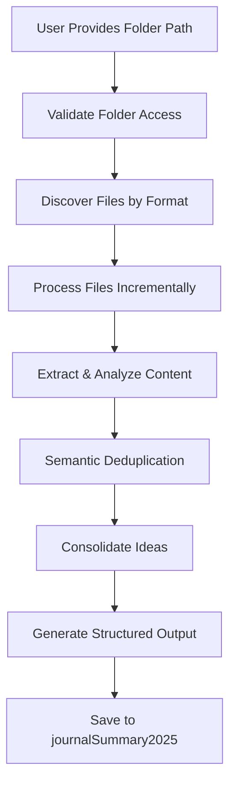

# Design Document

## Overview

The Research Consolidation Tool is an AI-powered Standard Operating Procedure (SOP) that enables intelligent consolidation of research documents from multiple formats into two primary outputs: (1) A comprehensive table of ideas/observations/insights without source attribution, focusing on capturing ALL interesting thoughts across documents, and (2) A table of unique URLs with context about their relevance to the research themes.

The design follows a pipeline architecture where documents are processed incrementally, analyzed for unique concepts, and consolidated into structured tables optimized for comprehensive coverage rather than source traceability.

## Architecture

### High-Level Flow



### Processing Pipeline

The system operates through a multi-stage pipeline:

1. **Discovery Phase**: Identify and categorize files by format
2. **Extraction Phase**: Convert files to readable text using appropriate tools
3. **Analysis Phase**: Process content in chunks with semantic understanding
4. **Consolidation Phase**: Merge similar ideas and organize themes
5. **Output Phase**: Generate structured markdown with references

## Components and Interfaces

### File Discovery Component

**Purpose**: Identify and categorize files in the specified folder
**Interface**: 
- Input: Folder path (absolute or relative)
- Output: List of files categorized by format

**Supported Formats**:
- Text files: `.txt`, `.md`
- Structured data: `.json`
- Documents: `.doc`, `.docx` (via pandoc)
- PDFs: `.pdf` (via pandoc or pdftotext)

### Content Extraction Component

**Purpose**: Convert various file formats to processable text
**Interface**:
- Input: File path and format type
- Output: Text content in 100-line chunks

**Tools Integration**:
- `pandoc` for document conversion
- `head`/`tail` for chunked reading
- `pdftotext` for PDF extraction
- Native file reading for text formats

### Semantic Analysis Engine

**Purpose**: Analyze content chunks for ideas, themes, and concepts
**Interface**:
- Input: Text chunk + running context
- Output: Extracted ideas with metadata

**Analysis Capabilities**:
- Concept extraction and categorization
- Theme identification across documents
- URL and reference extraction
- Context maintenance across chunks

### Deduplication Engine

**Purpose**: Identify and merge similar concepts across documents without source tracking
**Interface**:
- Input: New ideas + existing knowledge base
- Output: Consolidated unique ideas without attribution

**Deduplication Strategy**:
- Semantic similarity analysis
- Concept clustering by theme
- Intelligent merging of related ideas
- Focus on comprehensive coverage over source tracking

### Output Generator

**Purpose**: Create two structured tables with consolidated research
**Interface**:
- Input: Consolidated ideas + collected URLs
- Output: Two-table markdown format

**Output Structure**:
- Executive summary
- Ideas & Insights Table (Category, Concept/Idea, Technical Details, Performance/Business Impact, Implementation Notes)
- Relevant URLs Table (URL, Context/Relevance, Related Ideas)

## Data Models

### Document Metadata
```
{
  "filepath": string,
  "format": string,
  "size_lines": number,
  "processed_chunks": number,
  "extraction_method": string
}
```

### Extracted Idea
```
{
  "id": string,
  "category": string,
  "concept": string,
  "technical_details": string,
  "performance_impact": string,
  "implementation_notes": string,
  "related_urls": [string]
}
```

### Knowledge Base
```
{
  "ideas": [ExtractedIdea],
  "categories": [string],
  "unique_urls": [URLEntry],
  "processed_file_count": number
}
```

### URL Entry
```
{
  "url": string,
  "context": string,
  "related_ideas": [string]
}
```

## Error Handling

### File Access Errors
- Invalid folder paths: Clear error message with suggested corrections
- Permission issues: Graceful degradation with accessible files only
- Missing tools (pandoc): Installation guidance and fallback methods

### Processing Errors
- Corrupted files: Skip with logging, continue processing
- Format conversion failures: Try alternative methods, log issues
- Large file handling: Automatic chunking with progress indicators

### Content Analysis Errors
- Semantic analysis failures: Fallback to text-based processing
- Memory constraints: Implement streaming analysis for large datasets
- Context overflow: Intelligent context summarization and continuation

## Testing Strategy

### Unit Testing
- File discovery accuracy across different folder structures
- Content extraction correctness for each supported format
- Semantic analysis consistency and accuracy
- Deduplication effectiveness with known duplicate content

### Integration Testing
- End-to-end processing of sample research folders
- Cross-format processing with mixed document types
- Large dataset processing with memory and performance monitoring
- Output quality validation with expert review

### Performance Testing
- Processing speed benchmarks for different file sizes
- Memory usage profiling during large document processing
- Scalability testing with varying numbers of documents
- Tool dependency performance (pandoc, pdftotext)

### Validation Testing
- Semantic accuracy of idea extraction
- Deduplication effectiveness measurement
- Source reference integrity verification
- Output document structure and readability assessment

### Direct Terminal Processing

To streamline research consolidation, process files directly in the terminal without creating intermediate files. For example:

```bash
awk 'NR>60 && NR<=80' /path/to/research/file.txt
```
This approach reduces overhead and simplifies workflows.