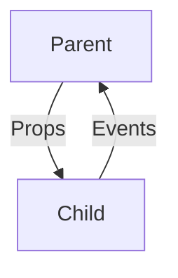

# Top-Tier React 2025 Analysis
*Analysis completed: 2025-08-28*

## 1. Server-Centric React Architecture

### 1.1 React Server Components (RSC)
- **Default Rendering Model**: Server-first approach
- **Benefits**:
  - Smaller client bundle size
  - Improved performance (LCP, TTI)
  - Better security (sensitive logic stays server-side)
- **Implementation**:
  ```jsx
  // Server Component (default)
  async function UserProfile({ userId }) {
    const user = await fetchUser(userId);
    return <Profile user={user} />;
  }
  ```

### 1.2 Data Fetching Patterns
| Pattern | Use Case | Implementation |
|---------|----------|----------------|
| Server Components | Initial page load | `async/await` in RSC |
| Server Actions | Form submissions | `"use server"` directive |
| TanStack Query | Client-side data | `useQuery`/`useMutation` |

## 2. Core React Principles

### 2.1 Component Purity
- **Rule**: Same props in → Same JSX out
- **Benefits**:
  - Predictable rendering
  - Better performance
  - Easier testing
- **Anti-pattern**: Side effects in render

### 2.2 One-Way Data Flow

- **Lift State Up**: Shared state to common ancestor
- **Colocate State**: Keep state close to where it's used

## 3. Component Patterns

### 3.1 Compound Components
```jsx
<Tabs>
  <TabList>
    <Tab>Profile</Tab>
    <Tab>Settings</Tab>
  </TabList>
  <TabPanels>
    <TabPanel>Profile Content</TabPanel>
    <TabPanel>Settings Content</TabPanel>
  </TabPanels>
</Tabs>
```

### 3.2 Headless Components
- **Logic + UI Separation**
- **Accessibility Built-in**
- **Example**: `useCombobox` from Downshift

## 4. State Management

### 4.1 State Classification
| Type | Example | Solution |
|------|---------|-----------|
| Local State | Form inputs | `useState` |
| Shared State | Theme, Auth | Context API |
| Server State | API data | TanStack Query |
| URL State | Filters | `useSearchParams` |

### 4.2 When to Use What
- **`useState`**: Simple component state
- **`useReducer`**: Complex state logic
- **Context API**: App-wide state
- **Zustand/Redux**: Complex global state

## 5. Performance Optimization

### 5.1 Memoization
```jsx
// Only re-render when props change
const UserList = React.memo(({ users }) => (/* ... */));

// Memoize expensive calculations
const sortedUsers = useMemo(
  () => users.sort((a, b) => a.name.localeCompare(b.name)),
  [users]
);
```

### 5.2 Code Splitting
```jsx
const HeavyComponent = React.lazy(() => import('./HeavyComponent'));

function App() {
  return (
    <Suspense fallback={<Spinner />}>
      <HeavyComponent />
    </Suspense>
  );
}
```

## 6. Styling in 2025

### 6.1 Recommended Solutions
| Library | Type | Features |
|---------|------|----------|
| Tailwind CSS | Utility-first | JIT, Dark mode |
| Panda CSS | Type-safe | Atomic CSS-in-JS |
| Vanilla Extract | Zero-runtime | Type-safe, Theming |

### 6.2 CSS Modules
```css
/* Button.module.css */
.primary {
  background: blue;
  color: white;
}

/* Component */
import styles from './Button.module.css';
<button className={styles.primary}>Click</button>
```

## 7. Testing Strategy

### 7.1 Testing Pyramid
```
       /\
      /  \
     /    \
    / Unit \
   /________\
  /          \
 / Integration \
/______________\
/    E2E       \
/_______________\
```

### 7.2 Testing Library Best Practices
```jsx
// ❌ Avoid
const button = container.querySelector('button');

// ✅ Do
expect(screen.getByRole('button', { name: /submit/i })).toBeInTheDocument();
```

## 8. Project Structure

### 8.1 Feature-Sliced Design
```
src/
├── app/           # App entry
├── pages/         # Page components
├── widgets/       # Independent UI blocks
├── features/      # Business features
├── entities/      # Business entities
└── shared/        # Shared components & utils
```

### 8.2 File Naming
- `PascalCase` for components (`UserProfile.jsx`)
- `camelCase` for utilities (`formatDate.js`)
- `kebab-case` for files in kebab-case directories

## 9. Common Anti-Patterns

### 9.1 To Avoid
1. **Prop Drilling** → Use Context or Composition
2. **`useEffect` for Data Fetching** → Use RSC or TanStack Query
3. **Direct DOM Manipulation** → Use Refs Sparingly
4. **Large Components** → Split into Smaller Ones
5. **Ignoring Accessibility** → Use ARIA, Test with Screen Readers

### 9.2 Performance Pitfalls
- Unnecessary re-renders
- Large bundle sizes
- Unoptimized images
- Missing `key` props in lists

## 10. Tooling

### 10.1 Essential Tools
- **Linting**: ESLint + `eslint-plugin-react-hooks`
- **Formatting**: Prettier
- **Type Checking**: TypeScript
- **Testing**: Jest + React Testing Library
- **Bundler**: Vite/Webpack

### 10.2 Recommended VS Code Extensions
- ESLint
- Prettier
- Tailwind CSS IntelliSense
- GraphQL
- Path IntelliSense

*Analysis conducted according to Minto Pyramid Principle*
