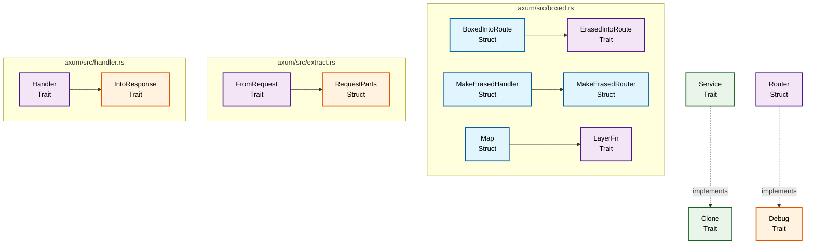
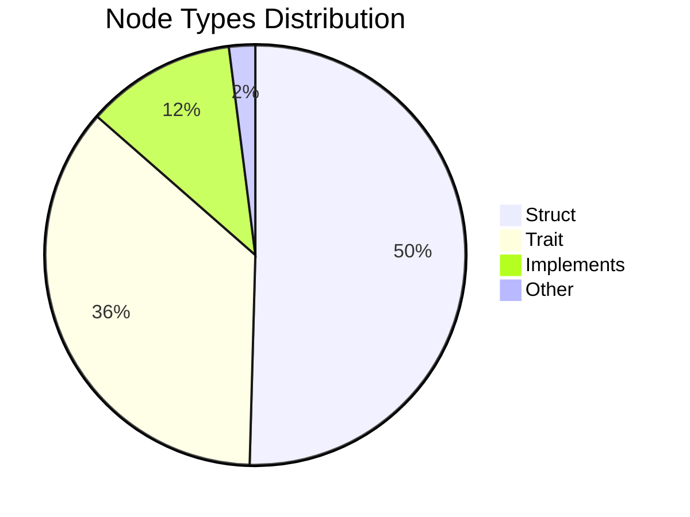

# Parseltongue Snapshot Analysis

This document contains a visual representation of the Rust code structure captured in `parseltongue_snapshot.json`.

## Code Structure Diagram

## Summary Statistics

Based on the metadata from `parseltongue_snapshot.json`:

- **Version**: 1
- **Node Count**: 694
- **Edge Count**: 80
- **Timestamp**: 1758431486

## Node Type Distribution

## Key Relationships

The diagram above shows the main structural relationships between different Rust elements:

1. **Structs** (blue): Core data structures
2. **Traits** (purple): Behavior definitions
3. **Implementations** (green): Trait implementations
4. **Relationships** (arrows): Dependencies and inheritance

## File Organization

The nodes are organized by file path, showing how the codebase is structured across different modules:

- `axum/src/boxed.rs` - Boxed and erased types
- `axum/src/extract.rs` - Request extraction utilities
- `axum/src/handler.rs` - Handler trait definitions

This visualization helps understand the architectural patterns and dependencies within the codebase.
