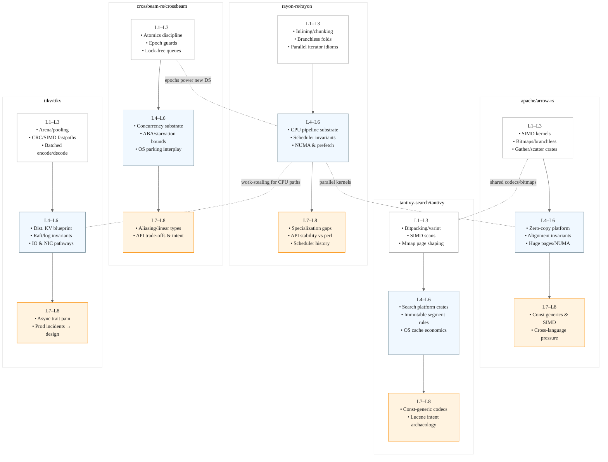
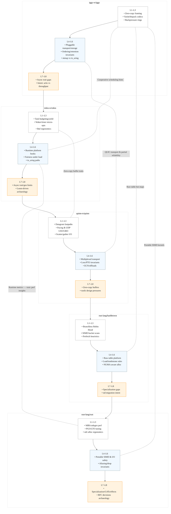

## The 5 repos to mine for Grandmaster-level Rust (CPU-intensive) and why

-  rayon-rs/rayon
    - 10x leverage: The canonical work-stealing runtime and parallel-iterator meta-patterns that define CPU-saturating Rust. Touches inlining, chunking, cache locality, scheduling invariants. High reputation surface: any measured scheduler or trait-level improvement lands ecosystem-wide.
-  crossbeam-rs/crossbeam
    - 10x leverage: Epoch-based memory reclamation, lock-free deques/queues, atomics and ordering discipline. This is the crucible where unsafe is turned into safe APIs. Mastery here makes you the go-to for high-performance concurrency correctness.
-  apache/arrow-rs
    - 10x leverage: Columnar memory, bitmaps, vectorized kernels, and SIMD-first design—the substrate for modern data/LLM pipelines. Improvements ripple into analytics engines, feature stores, and dataset tooling.
-  tantivy-search/tantivy
    - 10x leverage: Lucene-caliber search in Rust: inverted indexes, postings, bitpacking, SIMD scans, mmap discipline. It’s a living museum of mechanical sympathy for text and integer-heavy workloads—perfect for advanced CPU craft.
-  tikv/tikv
    - 10x leverage: Production-grade distributed KV with Raft. Forces you to reconcile performance with invariants (linearizability, snapshot safety) across async boundaries. Any tangible win here has outsized credibility.

## Why these five (as a set)

-  Full-stack CPU mastery: from single-core bit tricks (Tantivy) → data-parallel vectorization (Arrow) → work-stealing across cores (Rayon) → lock-free primitives (Crossbeam) → distributed invariants at scale (TiKV).
-  Knowledge arbitrage: distills decades from Lucene, TBB/OpenMP, epoch GC, columnar analytics, and Raft into Rust’s idioms—precisely where Rust can surpass prior ecosystems.
-  LLM leverage: Arrow + Tantivy define high-throughput ingest/index/scan for corpus building; Rayon/Crossbeam accelerate preprocessing/augmentation; TiKV patterns generalize to distributed dataset services with tight SLAs.

## Per-repo extraction map (L1–L8)

-  rayon-rs/rayon
    - L1 (Idioms & micro-opts): task splitting heuristics, inlining boundaries, chunk sizes, small-vector optimizations, spill avoidance, cache-friendly fold/reduce.
    - L2 (Design/composition): trait layering for IntoParallelIterator, adapter ergonomics, scoped parallelism, cancellation and early-exit patterns.
    - L3 (Micro-libs): reusable parallel primitives (parallel prefix-sum, stable partition), generic task graph kernels.
    - L4 (Macro-platform): “CPU data engine” substrate for Arrow/DataFusion-style pipelines; cross-crate, zero-friction interop patterns.
    - L5 (Invariants): scheduler fairness vs. locality, work-stealing deque safety, panic propagation guarantees, scoped lifetimes.
    - L6 (Hardware): NUMA-aware pinning, prefetch hints, false-sharing avoidance, adaptive chunking under turbo/thermal constraints.
    - L7 (Language): specialization boundaries, trait aliasing, negative bounds, async interop without regressions.
    - L8 (Intent archaeology): scheduler evolution across regressions; how API stability constrained optimizations.
-  crossbeam-rs/crossbeam
    - L1: atomics discipline (Acquire/Release/AcqRel), fences, cache-line padding, false sharing, minimal unsafe surfaces.
    - L2: RAII guards for epochs, API shapes that encode memory safety contracts, deque/queue composability.
    - L3: standalone lock-free building blocks (MPSC/MPSC-bounded variants, ring buffers) tuned for real workloads.
    - L4: “Concurrency substrate” for runtimes and DB/storage engines; standardizing lock-free patterns.
    - L5: epoch advancement invariants, ABA defenses, starvation bounds, backoff strategy correctness.
    - L6: OS interaction via parking, futex-like wakeups, interaction with thread schedulers.
    - L7: gaps in aliasing model, linear/affine types for hazard pointers, stronger atomics ergonomics.
    - L8: trade-offs that led to today’s APIs (e.g., perf vs. complexity in epoch reclamation).
-  apache/arrow-rs
    - L1: branchless bitmaps, vectorized kernels (std::simd or equivalent), alignment/padding, dictionary encoding fastpaths.
    - L2: Array/Buffer/Bitmap abstractions; zero-copy FFI boundaries; DX of builders without perf loss.
    - L3: micro-kernels (bitset ops, take/gather/scatter, radix partition) factored as independent crates.
    - L4: ecosystem platform (C Data Interface, Arrow Flight interop) for zero-copy pipelines and lakehouse engines.
    - L5: invariants on offsets/validity, alignment guarantees, canonicalization of null semantics.
    - L6: HW interplay: SIMD width adaptation, prefetching, huge pages, NUMA-aware buffers.
    - L7: const generics for widths, portable SIMD stabilization gaps, unsafe abstractions that want language support.
    - L8: cross-language design pressure vs. Rust ergonomics; lessons from C++/Java Arrow.
-  tantivy-search/tantivy
    - L1: bitpacking/varint codecs, SIMD-accelerated scans, branchless posting traversal, mmap page-fault shaping.
    - L2: builder-style indexing APIs, tokenization pipelines, FST integration patterns.
    - L3: reusable codecs/bitset structures; SIMD UTF-8 validation and normalization.
    - L4: search platform components (segmented storage, query planner hooks) as standardized crates.
    - L5: invariants: immutable segments, safe concurrent readers during merges, snapshotting semantics.
    - L6: OS page cache economics, direct I/O tradeoffs, NUMA-aware segment placement.
    - L7: const-generic codecs; lifetime-safe zero-copy views over postings.
    - L8: Lucene archeology reframed in Rust; constraints that shaped codec/API choices.
-  tikv/tikv
    - L1: allocation hotspots (bytes, smallvec), checksum/CRC SIMD fastpaths, arena/pool reuse, protobuf encoding costs.
    - L2: engine traits, raft-store layering, error/Retry ergonomics without perf cliffs.
    - L3: micro-libs: Yatp threadpool, raft-rs, rate limiters, batched apply/commit loops.
    - L4: platform blueprint for distributed storage; reusable scheduling and backpressure components.
    - L5: invariants: Raft safety, snapshot/install correctness, log compaction and fencing, consistency under failure.
    - L6: NIC/IO paths, syscalls, mmap vs. buffered I/O, io_uring opportunities for certain paths.
    - L7: async trait pain points, Pin/Unpin ergonomics, borrow checker pressure in long-lived state machines.
    - L8: production incident postmortems and benchmarks guiding current architecture.

## Non-obvious, 10x arbitrage bets across repos

-  Arrow bitmaps ↔ Tantivy postings: unify a branchless bitmap core that powers both columnar nulls and document sets; publish as a micro-crate with portable SIMD and const-generic widths.
-  Rayon scheduling ↔ Arrow kernels: auto-chunked, cache-aware parallelization of vector kernels with NUMA/prefetch hints; make it a plug-in strategy for Arrow compute.
-  Crossbeam epochs ↔ new concurrent containers: a low-latency, cache-friendly concurrent hashmap or index tailored to read-heavy analytics; benchmark against hashbrown/evmap.
-  TiKV CPU paths ↔ Rayon/Crossbeam: selective replacement of generic threadpools with work-stealing for CPU-bound phases (encode/decode, checksum, compaction planning) with measurable tail-latency wins.
-  Tantivy codecs ↔ Arrow dictionary/encoding: shared, branchless varint/bitpack codecs standardized across search and analytics to remove duplicated, divergent implementations.

## The next 5 repositories (Iggy-centric + Rust fundamentals)

-  iggy-rs/iggy
    - 10x leverage: Turn Iggy into the canonical “Rust-native streaming core” with QUIC-first transport, zero-copy ingest, and bulletproof backpressure. Wins here translate directly into measurable throughput and latency for modern data systems.
    - L1–L3 (How): zero-copy framing (Bytes/IoSlice), varint/bitpack codecs, smallvec/arena reuse, backpressure ring buffers; builder ergonomics for stream/partition APIs.
    - L4–L6 (What): pluggable storage/transport (TCP/QUIC), ingestion pipeline topology, partition/retention invariants, mmap vs. buffered I/O, io_uring experiments, kernel-bypass feasibility.
    - L7–L8 (Future/Why): async trait ergonomics, specialization pain for codecs, intent archaeology across issue tracker on ordering/acks/retention trade-offs.
    - High-cred shots: QUIC transport module with partial reliability and low-jitter pacing; end-to-end zero-copy write path with measured tail-latency reduction.

-  tokio-rs/tokio
    - 10x leverage: The async substrate powering most Rust services. Small scheduling wins and structured concurrency patterns ripple across the ecosystem (including Iggy).
    - L1–L3: task budgeting/yield hints, local-queue tuning, timer-wheel and waker micro-opts, Bytes/Buf ergonomics; micro-libs for backpressure utilities.
    - L4–L6: runtime as platform (instrumentation hooks, cooperative scheduling contracts), fairness invariants under overload, io_uring integration paths.
    - L7–L8: async trait stabilization impact, generator backend limits, Loom-guided intent archaeology on concurrency bugs.
    - High-cred shots: cooperative-scheduling API that measurably reduces tail latency for CPU-heavy reactors; io_uring path that preserves DX while improving syscall aggregation.

-  quinn-rs/quinn (QUIC)
    - 10x leverage: Modern transport with multiplexing, 0-RTT, datagrams—ideal for streaming. Enables Iggy to leapfrog TCP head-of-line constraints while retaining Rust-native safety.
    - L1–L3: Datagram fast paths, scatter/gather I/O, pacing and GSO/GRO, ECN handling; composable congestion controllers (BBR/Cubic).
    - L4–L6: QUIC as a platform for services (streams vs datagrams), invariants (anti-amplification, loss detection, PTO), NIC offloads and busy-poll interplay.
    - L7–L8: zero-copy buffer traits, lifetimes across async I/O, rustls interop constraints shaping design.
    - High-cred shots: pluggable congestion-control API with production-grade BBR; partial-reliability datagram layer tuned for streaming semantics.

-  rust-lang/hashbrown
    - 10x leverage: The engine under std::collections::HashMap. Micro-optimizing probe sequences, SIMD search, and prefetching pays off across nearly every Rust service (Iggy hot paths included).
    - L1–L3: branchless Robin Hood, SIMD bucket scanning, tombstone tuning, prefetch heuristics; micro-crates for tiny maps/fixed-capacity maps.
    - L4–L6: standardized “raw table” patterns for zero-copy views; invariants (max load factor, relocation bounds), NUMA-aware alloc experiments.
    - L7–L8: specialization gaps for hashing backends, allocator hooks; archaeology from std migration and iteration-order guarantees.
    - High-cred shots: portable-SIMD accelerated probe kernels + prefetch strategy with real-world wins on hot key spaces.

-  rust-lang/rust (compiler + std/alloc/collections)
    - 10x leverage: Shaping the language/runtime itself. Performance, ergonomics, and safety improvements here define what’s possible across all other repos.
    - L1–L3: monomorphization heuristics, inlining/PGO/LTO guidance for CPU-heavy crates; std::alloc ergonomics (guarded arenas, bump allocators), MIR optimizations that enable branchless kernels.
    - L4–L6: platform work (portable SIMD stabilization, io safety, zero-cost async primitives), memory model clarifications; invariants (drop order, aliasing).
    - L7–L8: specialization, effects, GAT refinements, coroutines; RFC archaeology where performance and soundness battled to stalemate.
    - High-cred shots: portable SIMD stabilization aids for branchless data paths; monomorphization-budget tuning that shrinks compile time for high-generic compute without runtime regressions.

## Why these five (as a set)
-  Iggy-centered stack: transport (Quinn), async runtime (Tokio), core data structures (HashBrown), and language/runtime fundamentals (rustc/std) around the streaming engine you care about.
-  Reputation compounding: contributions land both in a visible product (Iggy) and in primitives used by nearly every Rust service.
-  CPU-first mastery: network pacing/offloads (Quinn), scheduling (Tokio), cache-friendly structures (HashBrown), and codegen/MIR (rustc) converge on end-to-end throughput and predictable tails.

## Cross-repo arbitrage (aimed at Iggy dominance)
-  QUIC-first Iggy: integrate Quinn with partial reliability, ECN-aware pacing, and GSO batching; measure tail latency vs TCP under loss.
-  HashBrown in hot loops: adopt raw-table APIs for dedupe/offset maps; prefetch-aware scans for skewed keys.
-  Tokio cooperation contract: implement task-budget hints from Iggy’s reactors; upstream scheduling metrics that guide yield points.
-  rustc portable-SIMD push: codify branchless bitset/codec kernels used in Iggy and generalize as stable intrinsics.
-  Zero-copy everywhere: Bytes/IoSlice path from network → parser → WAL; prove with flamegraphs that syscalls and copies shrink.

