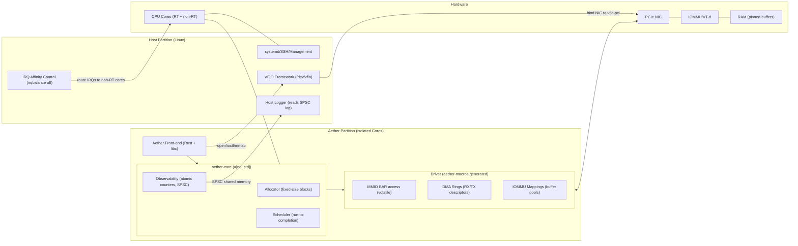
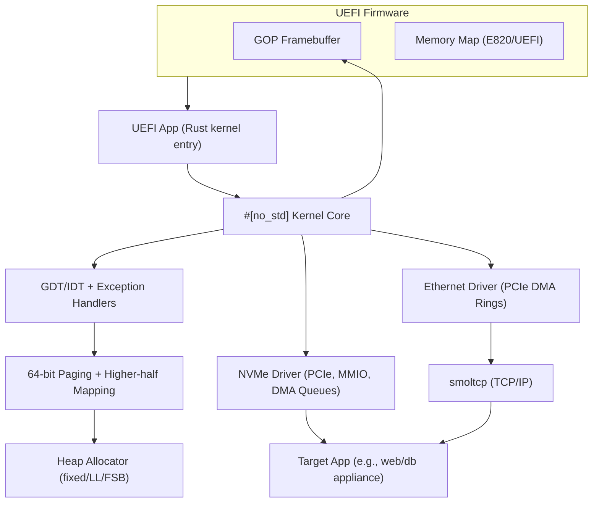

### Aether x RustOSS: A Minto Pyramid Principle Synthesis (Technical + Business)

**Governing Thought (Answer first):** Building a specialized, Rust-centric compute substrate is feasible and strategically compelling when scoped as (a) a partitioned runtime on Linux for determinism and kernel-bypass I/O (Aether), and/or (b) a headless Rust OS/unikernel for tightly scoped server use-cases on specific hardware—provided we abandon NVIDIA GPU ambitions, focus on NVMe/NIC enablement, and package the result as a hardware-certified appliance for initial market traction in ultra-low-latency domains (HFT, then telecom/industrial).

—

### Key Supporting Points (Grouped logic)

- **Determinism via Partitioned Runtime (Aether):** Isolate CPU cores, use VFIO/IOMMU to bypass the kernel, and co-design observability to achieve low and predictable tail latencies compared to AF_XDP or stock stacks.
- **Feasible Rust OS Track (Headless/Unikernel):** Use UEFI boot + #[no_std] progression; enable NVMe + Ethernet; treat the NVIDIA GTX 1650 as inert; unikernel (e.g., Hermit) aligns with single-purpose appliances and I/O-bound workloads.
- **Architectural Foundations:** Separation kernels and partitioned OS concepts justify mixed-criticality consolidation; compare kernel styles and isolation tech to pick the right substrate for each use case.
- **Go-to-Market Reality:** Hardware compatibility is the main execution risk; mitigate with a strict HCL and an appliance model; beachhead HFT buyers demand verifiable benchmarks.

—

### What This Unifies From The Sources

- `RustOSS Custom OS on Specific Hardware.md`: OS-from-scratch feasibility on Lenovo Y540; NVMe/Ethernet doable; NVIDIA GPU is a blocker; unikernel recommendation and use-case matrix; phased boot-to-drivers plan.
- `RustOSS runtime.md`: Partitioned runtime (Aether) plan with VFIO, core isolation, and a metaprogrammed user-space driver toolkit; hybrid approach with rigorous instrumentation; concrete L2-forwarding PoC and benchmarking methodology.
- `Partitioned Runtime_ Analysis and Applications_.md`: Conceptual foundation of partitioning for isolation vs parallelism; separation kernel role; comparative kernel/isolation tables and mixed-criticality rationale.
- `RustOSS part 1 Aether Runtime Business Evaluation.txt` and `(1).md`: Executive summary, performance positioning (vs Onload/VMA/DPDK/AF_XDP), risks (HCL, enterprise sales), and GTM sequencing (HFT → telecom/industrial), plus the appliance strategy.

—

### Tables (High-signal synthesis)

#### 1) Hardware Enablement Difficulty (Lenovo Y540 focus)

| Component | Feasibility in Rust | Core Tasks | Major Risks | Verdict |
| :-- | :-- | :-- | :-- | :-- |
| CPU/i7-9750H + HM370 | High | GDT/IDT, APIC, ACPI parse | Early-exception handling; APIC config | Straightforward with `x86_64` + `acpi` crates |
| NVMe SSD | Medium-High | PCIe, MMIO, DMA queues | Unsafe DMA setup; data corruption if wrong | Achievable (study rnvme, Redox, vroom) |
| Ethernet NIC (wired) | Medium | PCIe DMA rings, interrupts | Complex RX/TX paths and rings | Achievable; pairs well with `smoltcp` or kernel-bypass |
| Intel Wireless-AC 9560 | Low | Firmware load, 802.11 state machines | Proprietary blobs, RF complexity | Defer; focus on wired |
| NVIDIA GTX 1650 | Near-zero | Full driver stack | Proprietary interfaces, firmware | Abandon; use UEFI framebuffer only |

#### 2) Kernel Architecture Comparison

| Feature | Monolithic | Modular (Monolithic + modules) | Microkernel | Separation Kernel |
| :-- | :-- | :-- | :-- | :-- |
| Services in kernel | Many | Many (loadable) | Minimal | Only separation + mediated IPC |
| Strength | Performance | Flexibility | Reliability/security | Highest assurance/determinism |
| Weakness | Low robustness | Kernel-space fragility remains | IPC overhead | Specialized; not GP |
| Examples | Linux, Unix | Linux, FreeBSD | QNX, L4, Minix3 | INTEGRITY, PikeOS |

#### 3) Isolation Technology Trade-offs

| Feature | VM | Container | Partitioned Runtime (Separation Kernel) |
| :-- | :-- | :-- | :-- |
| Isolation boundary | Hypervisor | Host kernel | Minimal hypervisor (SK) |
| Overhead | High | Low | Low-to-moderate |
| Startup | Slow (minutes) | Fast (seconds) | Fast, near bare-metal |
| Security | Strong | Weaker (shared kernel) | Strongest (small TCB) |
| Real-time | No | No | Yes (by design) |
| Ideal | Legacy OS isolation | Cloud-native agility | Mixed-criticality, certifiable RT |

#### 4) Aether vs Alternatives (Latency/Positioning)

| Stack | Mechanism | Reported Latency Tier | Notes |
| :-- | :-- | :-- | :-- |
| Aether (proposed) | CPU isolation + VFIO kernel-bypass | P99.9 single-digit µs (competitive) | Emphasis on jitter reduction and determinism |
| AMD OpenOnload | Kernel-bypass | ~3.1–4.5 µs small packets | Mature in finance |
| NVIDIA VMA | Kernel-bypass | Down to ~1–2 µs in direct-connect cases | Vendor-tuned, NIC-coupled |
| AF_XDP (Linux) | Fast-path in kernel | Higher jitter/tails vs bypass | Free, improving baseline |

Note: Third-party numbers are from vendor docs/benchmarks. Independently verify on target HCL.

#### 5) Aether Technical Core (Determinism-first)

| Element | Decision/Design | Rationale |
| :-- | :-- | :-- |
| CPU core isolation | `isolcpus`, `nohz_full`, `rcu_nocbs` | Remove scheduler and tick noise |
| Device control | `vfio-pci` + IOMMU | Secure userspace MMIO/DMA |
| Runtime | Rust `#[no_std]` core lib + thin libc front-end | Safety + precise control |
| Drivers | Procedural macro generation for registers/DMA | Reduce unsafe boilerplate risk |
| Observability | Atomic counters + SPSC logs in shared memory | Low overhead, host-side scraping |
| Benchmarking | L2 forwarder vs AF_XDP baseline | Apples-to-apples latency/jitter proof |

#### 6) Rust OS/Unikernel Track (Server appliance focus)

| Decision | Implication |
| :-- | :-- |
| Use UEFI + `uefi-rs` + `#[no_std]` | Clean boot path and memory map |
| Prioritize NVMe + Ethernet | Create a useful headless system |
| Abandon NVIDIA GPU | Restrict to framebuffer or serial |
| Prefer Unikernel (Hermit) for I/O-bound services | Eliminate syscall boundary overhead |

#### 7) Phased Roadmaps (Engineering)

| Track | Phases | Outcome |
| :-- | :-- | :-- |
| Aether (partitioned runtime) | 1) Host tuning + VFIO bind → 2) Hello-VFIO MMIO map → 3) `aether-core` (allocator, scheduler, observability) → 4) `aether-macros` driver toolkit → 5) L2 forwarder + HDR histograms | Deterministic kernel-bypass data plane with PoC metrics |
| Rust OS on Y540 | 1) QEMU bring-up (exceptions, allocator) → 2) UEFI boot on hardware → 3) NVMe driver → 4) Ethernet + `smoltcp` → 5) Use-case specialization | Headless server OS/unikernel path |

#### 8) Business Risks and Mitigations

| Risk | Why it matters | Mitigation |
| :-- | :-- | :-- |
| Hardware compatibility (HCL) | Performance/bugs tied to specific CPUs/NICs/BIOS | Rigid HCL; certify 1–2 SKUs; invest in lab |
| Enterprise sales cycle | 6–18+ months; proof demanded | Lighthouse PoCs; publish bench whitepapers |
| Competitive moat | VMA/Onload incumbents; DPDK; AF_XDP improving | Differentiate on jitter/determinism + appliance integration |
| Debuggability/ops | Kernel-bypass reduces standard tooling | First-class observability design; host-side tools |

—

### Decision Pathways (Scope to win)

- If your goal is lowest jitter on commodity Linux: pursue Aether. Keep scope tight: one NIC model, 1–2 servers in HCL, and a single L2-forwarder benchmark narrative to win lighthouse HFT accounts.
- If your goal is an educational or specialized headless appliance: follow the Rust OS/unikernel track; do not chase the NVIDIA GPU; deliver a minimal I/O-capable system and iterate.

—

### Minimal Execution Checklists

#### Aether (day-0 essentials)

- GRUB params: `intel_iommu=on iommu=pt isolcpus=<rt-cores> nohz_full=<rt-cores> rcu_nocbs=<rt-cores>`
- IRQ affinity: pin all non-target IRQs to non-RT cores; bind NIC to `vfio-pci`.
- Map BARs with `ioctl` + `mmap`; validate device ID via volatile reads.
- Ship `aether-core` (allocator, run-to-completion scheduler, counters, SPSC log).
- Generate driver with `aether-macros`; prove end-to-end packet path; benchmark vs AF_XDP.

#### Rust OS (day-0 essentials)

- Boot as UEFI app; implement IDT/GDT; paging; simple heap; serial/framebuffer log.
- Bring up NVMe with careful DMA safety; add Ethernet + simple TCP/IP.
- Integrate application; consider Hermit path if single-purpose server.

—

### Expected Outcomes

- Determinism-first data plane with defendable latency histograms; reproducible on a narrow HCL.
- A headless Rust OS/unikernel appliance blueprint runnable on modern x86 without GPU support.
- Clear decision criteria for when to pick partitioned runtime vs custom OS for a given product goal.

—

### References and Provenance

- Derived from: `RustOSS Custom OS on Specific Hardware.md`, `RustOSS runtime.md`, `Partitioned Runtime_ Analysis and Applications_.md`, `RustOSS part 1 Aether Runtime Business Evaluation.txt`, `RustOSS part 1 Aether Runtime Business Evaluation (1).md`.
- Third-party performance figures (OpenOnload/VMA, AF_XDP baselines) reflect vendor documents and public benchmarks noted in the sources; independently validate on your HCL before claims in marketing or SOWs.


---

### Expanded Research Notes and Citations (web-backed)

- VFIO and IOMMU for userspace device control
  - VFIO framework overview and APIs: `https://www.kernel.org/doc/html/latest/driver-api/vfio.html`
  - IOMMU fundamentals and Linux driver-API notes: `https://www.kernel.org/doc/html/latest/driver-api/iommu.html`
  - Security posture: device DMA isolation relies on IOMMU domain correctness; misconfiguration can permit memory corruption.

- CPU core isolation and host tuning (noise abatement)
  - Kernel parameters documentation (isolcpus, nohz_full, rcu_nocbs): `https://www.kernel.org/doc/html/latest/admin-guide/kernel-parameters.html`
  - IRQ affinity management and best practices: `https://www.kernel.org/doc/html/latest/admin-guide/irq.html`
  - Practical pattern: disable irqbalance, pin all non-target IRQs away from RT cores; verify via `/proc/interrupts`.

- AF_XDP baseline vs kernel-bypass stacks (DPDK, OpenOnload, VMA)
  - AF_XDP design and UMEM model: `https://www.kernel.org/doc/html/latest/networking/af_xdp.html`
  - AMD/Solarflare OpenOnload low-latency paper (µs-range): `https://www.arista.com/assets/data/pdf/JointPapers/Arista_Solarflare_Low_Latency_10GbE.pdf`
  - NVIDIA Mellanox VMA latency benchmarks: `https://network.nvidia.com/pdf/whitepapers/WP_VMA_TCP_vs_Solarflare_Benchmark.pdf`
  - Note: vendor figures are topology- and NIC-specific; reproduce on your HCL.

- Rust OS storage and networking feasibility
  - Rust-for-Linux NVMe driver (rnvme) status: `https://rust-for-linux.com/nvme-driver`
  - Userspace Rust NVMe driver and thesis (vroom): `https://github.com/bootreer/vroom` and `https://db.in.tum.de/~ellmann/theses/finished/24/pirhonen_writing_an_nvme_driver_in_rust.pdf`
  - `smoltcp` bare-metal TCP/IP stack: `https://github.com/smoltcp-rs/smoltcp`

- Unikernel path (Hermit) and UEFI boot in Rust
  - Hermit (Rust unikernel) docs and code: `https://hermit-os.org/` and `https://github.com/hermit-os/hermit-rs`
  - UEFI in Rust (GOP framebuffer, protocols): `https://github.com/rust-osdev/uefi-rs` and `https://docs.rs/uefi/latest/uefi/`

- NVIDIA GTX 1650 (Turing) driver constraints
  - nouveau project portal and firmware notes: `https://nouveau.freedesktop.org/`
  - Practical takeaway: modern NVIDIA stacks require signed firmware for clocks/PM; full-feature driver from scratch is not a tractable solo effort.

- Partitioning foundations and separation kernels
  - ARINC 653 (APEX, spatial/temporal partitioning): `https://en.wikipedia.org/wiki/ARINC_653`
  - Separation kernel concept (industry overview): `https://www.lynx.com/embedded-systems-learning-center/what-is-a-separation-kernel`
  - SYSGO technical article on separation kernels for certifiable systems: `https://www.sysgo.com/fileadmin/user_upload/data/professional_article_download/SYSGO_PA_2019-03_Separation_Kernel_as_a_basis_for_certifiable_applications_and_systems.pdf`

- Benchmarking methodology (latency histograms, traffic generators)
  - HDR Histogram basics and references: `https://hdrhistogram.github.io/HdrHistogram/`
  - MoonGen packet generator (DPDK-based, precise timestamping): `https://github.com/emmericp/MoonGen`
  - Cisco TRex traffic generator: `https://trex-tgn.cisco.com/` and core repo `https://github.com/cisco-system-traffic-generator/trex-core`

- Observability for partitioned runtimes
  - Lock-free SPSC ring buffers in Rust: `crossbeam` channels/utilities `https://github.com/crossbeam-rs/crossbeam` and `heapless` SPSC for `no_std` `https://github.com/japaric/heapless`
  - Userspace performance counters (perf_event_open): `https://man7.org/linux/man-pages/man2/perf_event_open.2.html` (with care on overhead vs determinism)

- Host/appliance strategy and HCL discipline
  - Vendor HCL practice (analogy) as a customer expectation setter: e.g., VMware HCL `https://www.vmware.com/resources/compatibility/search.php`
  - Go-to-market implication: sell a fixed SKU appliance to collapse integration risk; expand HCL later.

Note: Items above include external references not contained in the source docs; validate third-party claims on your certified hardware list before publication or customer commitments.

---

### Architecture Deep Dive: Rigorous Reasoning + Mermaid Diagrams

Assumptions and preconditions
- Host uses a recent Linux kernel with IOMMU enabled and VFIO present; kernel params include: `intel_iommu=on iommu=pt isolcpus=<rt-cores> nohz_full=<rt-cores> rcu_nocbs=<rt-cores>`.
- IRQs for non-target devices are pinned away from real-time cores; irqbalance is disabled; MSI-X vectors for the target NIC are directed to non-RT cores (or polling used on RT cores).
- NIC is unbound from the stock kernel driver and bound to `vfio-pci`; device is placed in a dedicated IOMMU group.
- Aether runtime process is split into a thin libc front-end and a `#[no_std]` core; device driver code is generated via procedural macros from a declarative device spec.
- Observability is first-class: atomic counters and SPSC shared-memory logging are exported to a host-side reader to avoid impacting RT cores.

Operational guarantees
- Spatial isolation: IOMMU prevents device DMA from accessing memory outside the configured mappings.
- Temporal isolation: RT cores are not scheduled for host tasks (no scheduler tick, no RCU callbacks); only the Aether runtime executes on them.
- Determinism focus: polling or carefully routed interrupts, fixed-size allocators, run-to-completion scheduling reduce jitter sources.

Failure modes and handling
- DMA programming error: device moved to FAULT state; driver quiesces queues and drops to a safe shutdown; state dump emitted via SPSC log.
- Unexpected interrupts on RT cores: detectable via counters; remedy is IRQ affinity correction and verification in `/proc/interrupts`.
- BAR mapping mismatch or device revision variance: macro-generated code is version-locked to datasheet; `cargo expand`-audited output; fail fast at init.

Implementation notes
- Userspace path: `open(/dev/vfio/vfio)` → group FD → device FD → `ioctl`(VFIO_DEVICE_GET_INFO/REGION_INFO) → `mmap` BARs → program NIC queues and MSI-X → run scheduler.
- Memory: fixed-size block allocator in `aether-core` for predictability; hugepages for buffer pools when appropriate.
- Networking fast path: RX ring → parse L2 headers → MAC learning table update → TX ring selection; all data copies minimized, use cache-aligned buffers.

Mermaid sequence: Aether partitioned runtime (device bring-up to data plane)

```mermaid
sequenceDiagram
    autonumber
    participant GR as "GRUB"
    participant LK as "Linux Kernel"
    participant VF as "VFIO Framework"
    participant HM as "IOMMU/VT-d"
    participant AE as "Aether Front-end (Rust + libc)"
    participant AC as "aether-core (#[no_std])"
    participant DR as "Driver (aether-macros generated)"
    participant NIC as "PCIe NIC"
    participant LOG as "Host Logger (non-RT core)"

    GR->>LK: "Boot with params: intel_iommu=on, iommu=pt,<br/>isolcpus,nohz_full,rcu_nocbs"
    LK->>HM: "Enable IOMMU domains"
    LK->>VF: "Expose /dev/vfio/vfio and IOMMU groups"
    LK->>NIC: "Unbind stock driver; bind to vfio-pci"
    AE->>VF: "open() VFIO, set container, get group + device fd"
    AE->>VF: "ioctl: query regions (BARs), MSI-X, DMA capabilities"
    AE->>VF: "mmap BARs into userspace"
    AE->>AC: "Init runtime: allocator, scheduler, observability"
    AE->>DR: "Load device spec; init driver (rings, doorbells)"
    DR->>HM: "Request DMA mappings for RX/TX buffers"
    DR->>NIC: "Program registers: queues, MTU, MSI-X/poll"
    loop Run-to-completion on isolated cores
        NIC-->>DR: "RX completion (poll or IRQ on non-RT)"
        DR->>AC: "Hand off packet buffer"
        AC->>AC: "Process L2 (learn+forward)"
        AC->>DR: "Enqueue TX descriptor"
        DR->>NIC: "Ring TX doorbell"
        AC->>LOG: "SPSC log: counters/events to host"
    end
```

Mermaid flowchart: components, isolation boundaries, and data flow



Rust OS/Unikernel track: boot and I/O stack (for headless appliance)



Details needed to implement
- UEFI path: use `uefi-rs` to obtain framebuffer pointer and memory map; switch to long mode; establish higher-half mapping; bring up heap before dynamic allocations.
- NVMe: enumerate via PCIe, map BAR, create Admin and I/O submission/completion queues; use IOMMU if available; implement queue doorbells and PRP lists; favor large contiguous buffer pools.
- Ethernet: configure RX/TX rings, MSI-X or polling, RSS if applicable; integrate with a minimal TCP/IP stack (`smoltcp`) for control-plane needs.
- App integration: link statically with the minimal kernel; prefer a unikernel like Hermit for cloud/HPC style workloads to bypass syscall boundary.
- Debug path: serial console (if available) or framebuffer text; structured logs to persistent storage or host via dedicated out-of-band channel.


