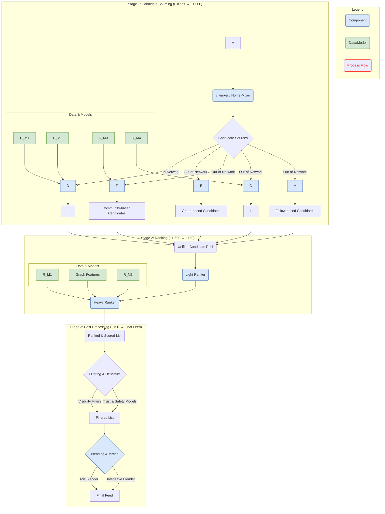

# Notes 20250910

## Plan for next few days - from 15 Sep to 25 Sep


## Deepthink Interface Stub Ideas

``` text
I further thought about your ideas - here are a few ideas to further push our thinking - and would love your creative thinking on this

use case: new greenfield project
- idea 1 - can we compress the code logic to 1% of the actual codebase which we have to write only using interface signatures? Basically Interface-Stub as an architecture spec. Basically a compact JSONL that declares requirements, types, operations, edges, scenarios, guards, policies. It should be able to help us analyze coverage, p99 budgets, idempotency, consistency

- idea 2 - 

```


## LLM Ranking Pipeline


