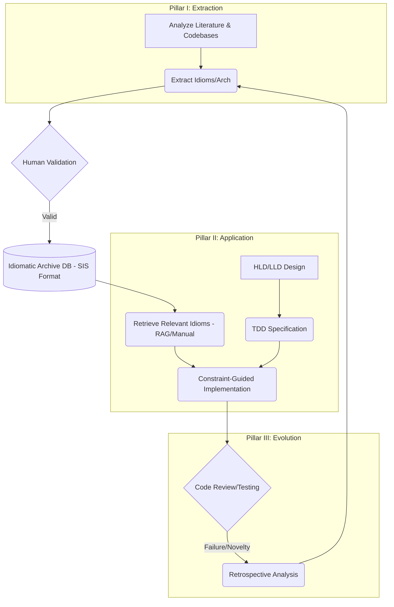

# What next in next 100 days

## Exploring a programming language in layers
``` text 
Exploration of a langauge in layers 
- Language features independent of OS - L1
    - no-std in rust
- standard libraries of the language - L2 is written with the help of L1
- external libraries of the language - L3 is written with help of only L1 or L1+L2
    - tokio in Rust, Axum framework
- now people start using the language
    - they will find useful-logic-templates for L1, L2, L3 which are basically called idiomatic patterns of the language
        - important to note
            - L1-idiomatic is different from L2-idiomatic is different from L3-idiomatic
            - idiomatic patterns are not thought of when the language features are released, they are discovered as an emergent property of the use the language itself, because a langauge is so complicated that all the permuations of combinations of using it cannot be predicted in advance
        - these 3 idiomatic collections are 20% of the langauge which can be enough to write
            - 99% code
            - with lowest bugs
            - with highest efficiency (memory usage, time usage)
            - with easiest readability (long term maintainability)
- At least in Rust idiomatic-low-bug code means the code which compiles in minimum attempts
    - This might not be the most efficient code and might not be the most readable code
    - This is different from other langauges because they can have runtime errors which can be caught at compile time in Rust
- Our immediate task is to
    1. Build comprehensive idiomatic collections for L1, L2, L3 based on internet research call it idiomatic-archive
        - patterns and anti-patterns are defined as per context of the code
    2. Evolve the idiomatic-archive by disovering new idiomatic patterns in our own work and adding them to the collection
    3. Further evolve the idiomatic-archive by finding new idiomatic patterns in the work of others and adding them to the collection, i.e. making the LLMs go through HQ codebases and find the idiomatic patterns
    4. Collect & evolve idiomatic-architecture-templates based on
        - Internet Research
        - Our own work
        - The work of others using the LLMs
    5. Use the idiomatic-archive to write code using LLMs
        - Break down problems into HLD and then LLD architectures
        - Use the TDD to implement the architectures
        - Use the idiomatic-archive to write meet the TDD criteria


```

This is a meta-strategy for operationalizing your 5-task Rust exploration workflow. It outlines the strategic breakdown of the problem and provides precise, high-level "Deep Research LLM Prompts" designed to leverage the capabilities of advanced models for knowledge extraction, synthesis, and application.

### The Strategic Overview: The Closed-Loop Idiomatic System

The 5 tasks are organized into three interdependent pillars: Extraction, Application, and Evolution. This strategy utilizes a dual-LLM role distinction: the **Research Agent** (for discovery) and the **Implementation Agent** (for coding).



### Prerequisite: The Standardized Idiom Schema (SIS)

To ensure the Archive is machine-readable and usable by LLMs (especially for Retrieval-Augmented Generation - RAG), a standardized schema is essential. This is the target format for all research prompts.

```json
{
  "id": "RUST-L[1|2|3]-[DOMAIN]-[PATTERN_NAME]",
  "layer": "L1 (Core/no_std) | L2 (Std) | L3 (Ecosystem)",
  "name": "Descriptive Pattern Name (e.g., Typestate Programming, Scoped Threads)",
  "domain_keywords": ["Error Handling", "Concurrency", "Memory Management"],
  "context_problem": "What specific problem does this solve? In what context is it applicable?",
  "solution_snippet": "A minimal, verified, compilable Rust code example.",
  "rationale": "Why is this superior? (Focus on Safety, Efficiency, Maintainability)",
  "anti_patterns": {
    "description": "What should be avoided?",
    "example": "A brief counter-example."
  },
  "relevant_crates": [], // (If L3, e.g., ["Tokio", "Serde"])
  "provenance": "Where was this discovered? (e.g., GitHub URL, Documentation, Internal Project)"
}
```

-----

### Pillar I: Knowledge Extraction & Curation (Tasks 1, 3, 4)

This pillar utilizes the **Research LLM (Discovery Agent)** to populate the Archive.

#### Strategy 1: Systematic Literature Sweep (Task 1)

Synthesizing established wisdom from documentation, blogs, and talks.

**Prompt Template 1: Systematic Idiom Research**

```
# ROLE
You are a Principal Rust Engineer and Researcher (The Discovery Agent).

# OBJECTIVE
Conduct a deep dive into [TARGET_DOMAIN] within Rust Layer [L1|L2|L3]. Identify and catalog the most critical idiomatic patterns.

# LAYER CONTEXT
[Provide specific context, e.g., "L1: Must be no_std compatible, zero-allocation." or "L3: Focus specifically on the Tokio ecosystem."]

# INSTRUCTIONS
1. Synthesize best practices from authoritative sources (official docs, RFCs, recognized expert blogs).
2. Identify 3-5 distinct, crucial idioms within this domain.
3. Document each idiom strictly according to the Standardized Idiom Schema (SIS).
4. VERIFICATION: Ensure all `solution_snippet` examples are minimal and compilable within the layer constraints.

# SIS FORMAT (Reference)
[INSERT FULL SIS JSON STRUCTURE HERE]

# OUTPUT FORMAT
A list of JSON objects adhering to the SIS.
```

#### Strategy 2: Forensic Codebase Analysis (Task 3)

Analyzing high-quality external codebases (e.g., `ripgrep`, `TiKV`, `rust-analyzer`). Note that due to LLM context limits, the human must select and paste specific modules.

**Prompt Template 2: Idiomatic Pattern Extraction from Code**

```
# ROLE
You are a Forensic Rust Code Analyst (The Discovery Agent).

# OBJECTIVE
Analyze the provided Rust code snippet from [CODEBASE_NAME] and extract novel or emergent idiomatic patterns.

# CONTEXT
[Describe the purpose and context of the code snippet, e.g., "This is the core scheduler loop from Tokio v1.30"].

<CODE_SNIPPET>
[PASTE TARGET CODE SNIPPET HERE]
</CODE_SNIPPET>

# INSTRUCTIONS
1. Analyze the code for unique uses of traits, ownership management, safety invariants, or performance optimizations.
2. Focus on *how* the code achieves its goal, not just *what* it does.
3. **Hypothesize the Rationale:** Why did the author choose this approach? What pitfalls does it avoid?
4. Determine the appropriate layer (L1, L2, or L3).
5. Document each novel pattern strictly according to the SIS.

# SIS FORMAT (Reference)
[INSERT FULL SIS JSON STRUCTURE HERE]

# OUTPUT FORMAT
A list of JSON objects adhering to the SIS.
```

#### Strategy 3: Architectural Template Synthesis (Task 4)

Focusing on macro-level structures.

**Prompt Template 3: Architectural Template Synthesis**

```
# ROLE
You are a Chief Software Architect specializing in Rust (The Discovery Agent).

# OBJECTIVE
Research and synthesize a comprehensive, idiomatic architectural template for the [ARCHITECTURAL_PATTERN] in Rust.

# DOMAIN FOCUS
[e.g., High-Performance Network Service (L3), Embedded System (L1), CLI Utility (L2/L3)].

# ANALYSIS REQUIREMENTS
1. **Module Structure & Hierarchy:** Idiomatic `src/` organization and workspace usage.
2. **Data Flow & State Management:** How is state shared (e.g., Arc<Mutex<T>>, channels, ECS)?
3. **Ownership Strategy:** How does the architecture leverage Rust's ownership model to enforce boundaries?
4. **Concurrency Model:** Async tasks, thread pools, message passing?
5. **Dependency Management:** How are boundaries enforced (e.g., Traits, Dependency Injection)?
6. **Error Handling Strategy:** Definition (thiserror/anyhow) and propagation (tracing).

# OUTPUT FORMAT
A detailed report including Overview, Core Components, Implementation Notes, a component diagram (using MermaidJS syntax), and a high-level code skeleton.
```

-----

### Pillar II: Knowledge Application (Task 5)

This pillar utilizes the **Coding LLM (Implementation Agent)** to write software, constrained by the Idiomatic Archive. The workflow is HLD -\> LLD -\> TDD -\> Implementation.

#### The Key: Constraint-Guided Generation

The critical step is ensuring the LLM uses the archive. This requires retrieval (identifying relevant idioms via RAG or manual selection) and injection (placing them in the prompt as constraints).

#### Strategy 4: Design (HLD/LLD)

**Prompt Template 4: HLD/LLD Generation**

```
# ROLE
You are a Rust Systems Designer (The Implementation Agent).

# OBJECTIVE
Generate the HLD and LLD for the specified requirement.

# REQUIREMENT
[Describe the software requirement, e.g., 'A high-throughput async API gateway'].

# ARCHITECTURAL CONSTRAINT
Adhere to the [Selected Architecture Template from Task 4, e.g., Hexagonal Architecture].

# TARGET ENVIRONMENT
[Specify L1, L2, or L3 constraints, e.g., "L3 utilizing Tokio/Axum"].

# OUTPUT FORMAT
HLD: System overview, component interaction diagram (MermaidJS syntax), Module Responsibilities.
LLD: Key structs/enums, Key public traits and function signatures (APIs), Control Flow description.
```

#### Strategy 5: TDD and Implementation

**Prompt Template 5: TDD Test Generation (The "Red" Phase)**

```
# ROLE
You are a Rust QA Engineer (The Implementation Agent).

# OBJECTIVE
Generate a comprehensive suite of unit tests for the specified LLD component (TDD Red Phase).

# INPUT LLD COMPONENT
[Paste the LLD definitions/signatures from Prompt 4].

# INSTRUCTIONS
1. Generate tests for the 'happy path'.
2. Generate tests for edge cases and boundary conditions.
3. Generate tests for error handling and failure modes.
4. Tests should compile against the interface but fail (e.g., function bodies are `unimplemented!()`).

# OUTPUT FORMAT
A complete Rust test module (`#[cfg(test)] mod tests { ... }`).
```

**Prompt Template 6: Constraint-Guided Implementation (The "Green" Phase)**

```
# ROLE
You are a Senior Rust Developer (The Implementation Agent).

# OBJECTIVE
Implement the specified component to pass the provided TDD tests, strictly adhering to the Idiomatic Guidelines (TDD Green Phase).

# INPUT LLD COMPONENT
[Paste the LLD definitions from Prompt 4].

# INPUT TDD TESTS
[Paste the tests generated by Prompt 5].

# IDIOMATIC GUIDELINES (Constraints)
[CRITICAL: Inject relevant idioms retrieved from the Archive here. Example injection:]
1. RUST-L2-ITERATOR-COMBINATORS: Prefer Iterators (`map`, `filter`) over manual `for` loops. Rationale: Efficiency and readability.
2. RUST-L3-ASYNC-MUTEX: Use `tokio::sync::Mutex` in async code, NOT `std::sync::Mutex`. Rationale: Avoid blocking the executor.

# INSTRUCTIONS
1. Implement the Rust code required to make the tests pass.
2. Rigorously follow the Idiomatic Guidelines.
3. Provide the implementation and a brief justification of how the guidelines were applied.

# OUTPUT FORMAT
The Rust implementation code.
```

-----

### Pillar III: Knowledge Evolution & Refinement (Task 2)

Pillar III is the feedback loop. When implementation fails or when novel solutions are discovered in your own work, we analyze the outcome to refine the Archive.

#### Strategy 6: Retrospective Analysis

**Prompt Template 7: Retrospective Analysis and Idiom Discovery**

```
# ROLE
You are a Rust Code Reviewer and Mentor (The Discovery Agent).

# OBJECTIVE
Analyze an implementation attempt from our own work, identify issues, propose improvements, and extract new idiomatic patterns (Task 2).

# INPUT CODE
[Paste the code generated by the LLM (Prompt 6) or written by a developer].

# SITUATION REPORT
[Describe the issue: Compiler error, failed test, Clippy warning, benchmark failure, or general code smell/complexity].

# ANALYSIS TASKS
1. Identify the root cause of the issue.
2. Determine if the issue stems from a violation of Rust safety rules, inefficiency, or non-idiomatic implementation (e.g., fighting the borrow checker).
3. Propose a refactored, idiomatic solution.
4. Extract any new insights or patterns discovered during this process and format them according to the SIS.

# OUTPUT FORMAT
Root Cause Analysis, Refactored Solution, and New Idiom Discovery (JSON object in SIS format, if any).
```