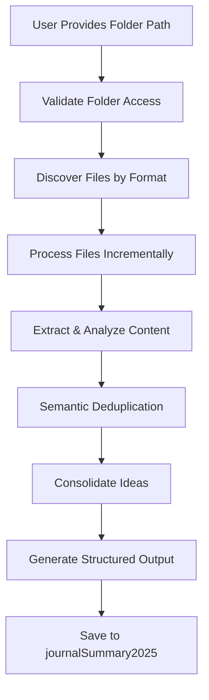

# Research Consolidation SOP for AI Assistants

# Research Consolidation SOP (Terminal-Only, Multi-Session)

## Purpose
Systematically consolidate research documents into:
1. **Ideas & Insights Table** – All technical concepts, performance claims, and implementation details (no source attribution)
2. **Relevant URLs Table** – All unique URLs with context and mapped relevance

## Step-by-Step Instructions

### 1. Get Research Folder Path
Ask for the absolute path (e.g., `/home/user/research-docs`).

### 2. Create Output Structure
```bash
mkdir -p journalSummary2025
```
Create `journalSummary2025/RustResearch_Consolidated_YYYYMMDD.md` with:
```markdown
# Research Consolidation Report
*Generated: [Date]*
*Source: [Number] files from [Folder Path]*

## Executive Summary
[Brief overview of research scope and key themes]

## Ideas & Insights Table
| Category | Concept/Idea | Technical Details | Performance/Business Impact | Implementation Notes |
|----------|--------------|-------------------|----------------------------|---------------------|

## Relevant URLs Table
| URL | Context/Relevance | Related Ideas |
|-----|-------------------|---------------|
```

### 3. Discover Files by Type
```bash
find "[FOLDER_PATH]" -name "*.md" -type f | wc -l
find "[FOLDER_PATH]" -name "*.txt" -type f | wc -l
find "[FOLDER_PATH]" -name "*.json" -type f | wc -l
find "[FOLDER_PATH]" -name "*.pdf" -type f | wc -l
find "[FOLDER_PATH]" -name "*.doc*" -type f | wc -l
```

### 4. Process Files in 500-Line Chunks (Terminal Only)
For each file:
```bash
head -500 "filename"           # First chunk
head -1000 "filename" | tail -500   # Second chunk
head -1500 "filename" | tail -500   # Third chunk
# Continue until end of file

# For PDF/DOCX:
pandoc "document.pdf" -t plain --wrap=none | head -500
pandoc "document.docx" -t plain --wrap=none | head -500
```

### 5. Extract URLs (Terminal Only)
```bash
grep -oE 'https?://[^[:space:])\]\}>"]+' "filename"
```

### 6. Content Analysis & Table Entry
- For each chunk, extract:
  - Technical concepts, architectures, performance claims, quantified benefits, implementation details
  - Add to Ideas & Insights Table (no source attribution)
  - Extract all unique URLs, deduplicate, and add to URLs Table with context and mapped relevance

### 7. Semantic Deduplication & Categorization
- Merge similar ideas into comprehensive entries
- Group by domain (e.g., Real-Time OS, Browser Engine, AI, etc.)
- Ensure all major themes are captured

### 8. Progress Tracking
- Use checkboxes or progress log in the markdown file
- Mark each file as processed

### 9. Multi-Session Continuation
If resuming:
```bash
cat journalSummary2025/RustResearch_Consolidated_*.md
grep "^|" journalSummary2025/RustResearch_Consolidated_*.md | wc -l
find "[FOLDER_PATH]" -name "*.txt" | wc -l
find "[FOLDER_PATH]" -name "*.json" | wc -l
find "[FOLDER_PATH]" -name "*.pdf" | wc -l
find "[FOLDER_PATH]" -name "*.doc*" | wc -l
```
Continue adding to tables, maintain no-source-attribution, and semantic deduplication.

## Quality Checklist
- [ ] All major technical architectures covered
- [ ] Performance claims with specific metrics included
- [ ] Business/market analysis captured
- [ ] Implementation technologies documented
- [ ] Cross-domain insights preserved
- [ ] All unique URLs extracted, deduplicated, and mapped
- [ ] Context clearly explains URL relevance
- [ ] Semantic deduplication completed
- [ ] All files processed systematically

## Completion Criteria
1. Ideas & Insights Table: 50-100+ comprehensive entries
2. URLs Table: 30-50+ unique, relevant URLs with context
3. All 439 files processed (md, txt, json, pdf, doc)
4. Well-organized, navigable markdown document
5. No source attribution; semantic deduplication throughout

## Error Handling & Automation
- If a file fails to process, log error and continue
- Use only terminal commands for chunking and extraction
- No intermediate files; direct appending to markdown output

## Example Terminal Workflow
```bash
RESEARCH_FOLDER="/home/amuldotexe/Downloads/zzRustResearch"
for file in $(find "$RESEARCH_FOLDER" -name "*.md" | head -10); do
  echo "Processing: $file"
  head -500 "$file"
  # Extract concepts and add to Ideas table
  # Extract URLs and add to URLs table
done
# Continue for other file types...
```

## Multi-Session Handoff
- Always review current consolidated document
- Load this SOP for methodology
- Identify next files to process
- Continue adding to tables (never restart)
- Maintain semantic deduplication and no-source-attribution

---
*This SOP enables any AI assistant or human to systematically process research documents using only terminal commands, ensuring comprehensive idea capture and relevant references across multiple sessions.*

## Task Checklist & Progress Tracking

- [x] 1. Process all markdown files from /home/amuldotexe/Downloads/zzRustResearch
  - Process 172 .md files using head/tail commands in 500-line chunks
  - Extract ALL interesting technical concepts, ideas, and insights from each file
  - Add entries to Ideas & Insights Table without source attribution
  - Collect URLs and add to URLs Table with context

- [ ] 2. Process all text files from /home/amuldotexe/Downloads/zzRustResearch
  - Process 91 .txt files using head/tail commands in 500-line chunks
  - Extract unique research insights and technical details for Ideas Table
  - Semantically merge with existing ideas without tracking sources
  - Extract and deduplicate URLs with relevance context

- [ ] 3. Process all JSON files from /home/amuldotexe/Downloads/zzRustResearch
  - Process 24 .json files to extract structured research data
  - Parse JSON for insights, analysis results, and technical specifications
  - Add comprehensive entries to Ideas Table focusing on completeness
  - Extract URLs and add context about their relevance to research themes

- [ ] 4. Process all PDF/DOC files from /home/amuldotexe/Downloads/zzRustResearch
  - Convert 150 PDF/DOC files to text using pandoc
  - Process converted content in 500-line chunks for comprehensive analysis
  - Extract research concepts and merge into Ideas Table without source tracking
  - Handle conversion errors gracefully and continue with remaining files

- [ ] 5. Perform semantic deduplication and consolidation
  - Analyze all extracted ideas for semantic similarity across all file types
  - Merge related concepts into comprehensive entries without source attribution
  - Organize ideas by categories (Real-Time OS, Browser Engine, AI Inference, etc.)
  - Finalize URLs Table with unique URLs and comprehensive context

- [ ] 6. Generate final two-table consolidated document
  - Create Ideas & Insights Table with comprehensive coverage of all concepts
  - Create URLs Table with unique URLs and relevance context
  - Include executive summary of key research themes
  - Ensure proper markdown formatting for both tables
  - Save to journalSummary2025 folder with timestamp

### Direct Terminal Processing
1. Identify the file to process.
2. Use terminal commands like `awk` or `grep` to extract relevant data.
3. Append insights directly to the consolidated markdown file without creating intermediate files.

### Multi-Session Continuation
- **State Recovery**: Use bash commands to check current progress and remaining files
- **Seamless Handoff**: Any LLM can continue work by reading current consolidated document
- **Progress Tracking**: Target 50-100+ Ideas entries, 30-50+ URLs entries from 439 total files
- **Quality Maintenance**: Preserve no-source-attribution approach across sessions
- **Completion Criteria**: All file types processed, semantic deduplication complete

## File-by-File Progress Log

- [x] Harry Potter UI Framework Evolved_.txt
- [x] Rewriting Rails in Rust - cloud cost impact.txt
- [x] before-i-go-interview-irodov.txt
- [ ] Cloud Cost Impact Analysis_.txt
- [ ] coderamp-labs-gitingest.txt
- [ ] DSL for Rust Frontend_ (1).txt
- [ ] DSL for Rust Frontend_.txt
- [ ] Enhancing Code Archiving Utility_ (2).txt
- [ ] Export all that you learnt in this chat in a sing... (1).txt
- [ ] Export all that you learnt in this chat in a sing....txt
- [ ] Harry Potter UI Framework Evolved_ (1).txt
- [ ] journal202504/Ideation20250418.txt
- [ ] journal202504/ideation20250419.txt
- [ ] journal202504/ideation20250420.txt
- [ ] journal202504/RustOSS part 1 Aether Runtime Business Evaluation.txt
- [ ] journal202506/Deep Dive Into Rust Runtime Architecture.txt
- [ ] journal202506/Rust Runtime Architecture Deep Dive.txt
- [ ] journal202508/RustHallowsBase04-part-10.txt
- [ ] journal202508/RustHallowsBase04-part-1.txt
- [ ] journal202508/RustHallowsBase04-part-2.txt
- [ ] journal202508/RustHallowsBase04-part-3.txt
- [ ] journal202508/RustHallowsBase04-part-4.txt
- [ ] journal202508/RustHallowsBase04-part-5.txt
- [ ] journal202508/RustHallowsBase04-part-6.txt
- [ ] journal202508/RustHallowsBase04-part-7.txt
- [ ] journal202508/RustHallowsBase04-part-8.txt
- [ ] journal202508/RustHallowsBase04-part-9.txt
- [ ] journal202508/RustHallowsBase04.txt
- [ ] journal202508/RustHallowsPrep20250815.txt
- [ ] journal202508/RustHallowsPrep2.txt
- [ ] Legacy-Free Browser_ Deep Research Analysis_.txt
- [ ] Marauder Post web.txt
- [ ] merged_output_20250816.txt
- [ ] merged_output_20250816v1.txt
- [ ] merged_output_20250816v2.txt
- [ ] OFL.txt
- [ ] # Parselmouth_ A Revolutionary Rust-Based Browser... (1).txt
- [ ] # Parselmouth_ A Revolutionary Rust-Based Browser....txt
- [ ] patternsRust/i00-pattern-list.txt
- [ ] promptsUsed/cursorRules20250502.txt
- [ ] promptsUsed/log20250418.txt
- [ ] Rust Backend DSL Design_.txt
- [ ] RustHallows GPT5 01.txt
- [ ] RustHallows Project Deep Dive.txt
- [ ] RustJobs Adoption Data Expansion & Analysis.txt
- [ ] Rust Kernel, Postgres Optimization_.txt
- [ ] Rust LLM Browser Engine Performance Deep Dive_.txt
- [ ] RustLLM Deep Dive Into Rust Runtime Architecture.txt
- [ ] RustLLM Enhancing Code Archiving Utility_ (1).txt
- [ ] RustLLM Enhancing Code Archiving Utility_.txt
- [ ] Rust LLM Ferrum_ Minimalist Backend DSL Prototype_.txt
- [ ] Rust LLM Legacy-Free Browser Engine Expansion_.txt
- [ ] Rust LLM Loco vs. Rails Popularity_.txt
- [ ] Rust LLM Project Veritaserum_ A Blueprint for a Unified, High-Performance Application Ecosystem.txt
- [ ] RustLLM response (1).txt
- [ ] RustLLM response (2).txt
- [ ] RustLLM response (3).txt
- [ ] RustLLM response (4).txt
- [ ] RustLLM response (5).txt
- [ ] RustLLM response (6).txt
- [ ] RustLLM response (7).txt
- [ ] RustLLM response (8).txt
- [ ] RustLLM response (9).txt
- [ ] RustLLM response.txt
- [ ] RustLLM Rust30020250814.txt
- [ ] RustLLM Rust30020250815.txt
- [ ] Rust LLM Rust Business App Browser Ideation_.txt
- [ ] RustLLM RustOSS part 1 Aether Runtime Business Evaluation.txt
- [ ] RustLLM Rust Runtime Architecture Deep Dive.txt
- [ ] RustLLM trun_4122b840faa84ad78124aa70192d96ab (1).txt
- [ ] RustLLM trun_4122b840faa84ad78e8b046375c5c2e2.txt
- [ ] RustLLM trun_4122b840faa84ad79c9c39b3ebabf8a0 (2).txt
- [ ] RustLLM trun_4122b840faa84ad7ad32e2e83c79a44e.txt
- [ ] RustLLM trun_4122b840faa84ad7bd3793df0e5f39ee.txt
- [ ] Rust LLM Veritaserum 2025.txt
- [ ] Rust LLM Zenith_ Rust Simplified Blueprint_ (1).txt
- [ ] Tokio Comparison.txt
- [ ] trun_4122b840faa84ad78e8b046375c5c2e2 (2).txt
- [ ] trun_4122b840faa84ad7a24867ec3a76c16a (copy).txt
- [ ] UBI Comprehensive Rust Idiomatic Patterns Guide.txt
- [ ] UBI Meta 20250714.txt
- [ ] UBI Rust Ferrum_ Minimalist Backend DSL Prototype.txt
- [ ] UBI Zenith_ Rust Simplified Blueprint.txt
- [ ] WhatsApp Chat with X mutuals.txt
- [ ] Zenith_ Rust Simplified Blueprint_.txt
- [ ] zzUnclassified/alias_d202409_20250418.txt
- [ ] zzUnclassified/CodeSOP_20250418.txt
- [ ] zzUnclassified/meta-repo20240419v1.txt
- [ ] zzUnclassified/meta-software20250419.txt
- [ ] zzUnclassified/SixLLM_20250418.txt
- [ ] zzUnclassified/study20250502v1.txt


# Research Consolidation SOP - Advanced Steering Document
**IMPORTANT: All file chunking and extraction must be performed using terminal commands only. Use 500-line chunks for all processing. No text file reading in code.**

*Based on systematic literature review methodologies, content analysis best practices, and automated research consolidation tool design*

## Pipeline Architecture & Automation

This SOP follows a multi-stage pipeline for intelligent, scalable research consolidation:

1. **Discovery Phase**: Identify and categorize files by format (supports .md, .txt, .json, .pdf, .doc, .docx)
2. **Extraction Phase**: Convert files to readable text using tools (`pandoc`, `pdftotext`, `head`, `tail`)
3. **Analysis Phase**: Process content in 100-line chunks, maintaining semantic context across chunks
4. **Consolidation Phase**: Merge similar ideas, organize by domain, and perform semantic deduplication
5. **Output Phase**: Generate structured markdown tables and save to `journalSummary2025` with timestamp

### High-Level Flow


## Theoretical Framework

### PRISMA-Inspired Systematic Review Process
Following adapted PRISMA (Preferred Reporting Items for Systematic Reviews and Meta-Analyses) guidelines:

1. **Identification**: Discover all relevant documents in the corpus
2. **Screening**: Filter documents by relevance and quality
3. **Eligibility**: Apply inclusion/exclusion criteria
4. **Synthesis**: Extract, analyze, and consolidate findings
5. **Reporting**: Generate structured, traceable output

### Grounded Theory Approach
- **Open Coding**: Identify concepts and categories from raw data
- **Axial Coding**: Establish relationships between categories  
- **Selective Coding**: Integrate categories around core themes
- **Theoretical Saturation**: Continue until no new insights emerge

## Terminal Commands for Systematic Processing

### File Discovery Commands
```bash
# Get total file count by type
find "/home/amuldotexe/Downloads/zzRustResearch" -name "*.md" -type f | wc -l
find "/home/amuldotexe/Downloads/zzRustResearch" -name "*.txt" -type f | wc -l  
find "/home/amuldotexe/Downloads/zzRustResearch" -name "*.json" -type f | wc -l
find "/home/amuldotexe/Downloads/zzRustResearch" -name "*.pdf" -type f | wc -l
find "/home/amuldotexe/Downloads/zzRustResearch" -name "*.doc*" -type f | wc -l

# Get sorted file lists for systematic processing
find "/home/amuldotexe/Downloads/zzRustResearch" -name "*.md" -type f | sort > md_files.txt
find "/home/amuldotexe/Downloads/zzRustResearch" -name "*.txt" -type f | sort > txt_files.txt
find "/home/amuldotexe/Downloads/zzRustResearch" -name "*.json" -type f | sort > json_files.txt
```

### Content Processing Commands
```bash
# Process files in 100-line chunks
head -100 "filename" | tail -100
head -200 "filename" | tail -100  # For second chunk
head -300 "filename" | tail -100  # For third chunk

# Get file line counts to determine chunks needed
wc -l "filename"

# Convert documents using pandoc
pandoc "document.pdf" -t plain --wrap=none | head -100
pandoc "document.docx" -t plain --wrap=none | head -100

# Extract URLs from content
grep -oE 'https?://[^[:space:]]+' "filename"
```

## Advanced Analysis Framework

### Multi-Level Coding Schema

#### Level 1: Descriptive Codes (What is being discussed?)
- **Technical Architecture**: OS design, kernel types, scheduling algorithms
- **Performance Metrics**: Latency, throughput, resource utilization
- **Implementation Details**: Code patterns, API designs, system interfaces
- **Business Context**: Market analysis, competitive positioning, use cases

#### Level 2: Interpretive Codes (How does it work?)
- **Causal Relationships**: X enables Y, A causes B performance improvement
- **Trade-offs**: Performance vs complexity, safety vs speed
- **Dependencies**: Component interactions, prerequisite technologies
- **Evolution Patterns**: How concepts develop across documents

#### Level 3: Pattern Codes (Why is this significant?)
- **Innovation Themes**: Novel approaches, paradigm shifts
- **Recurring Problems**: Common challenges across domains
- **Solution Archetypes**: Reusable architectural patterns
- **Strategic Implications**: Market differentiation, competitive advantages

### Content Analysis Dimensions

#### Temporal Analysis
- **Document Dating**: Identify creation/modification timestamps
- **Concept Evolution**: Track how ideas develop over time
- **Version Control**: Identify latest/most authoritative versions
- **Trend Analysis**: Emerging vs established concepts

#### Authority Analysis
- **Source Credibility**: Technical depth, implementation details
- **Cross-Validation**: Multiple sources supporting same claims
- **Expertise Indicators**: Technical sophistication, domain knowledge
- **Citation Patterns**: References to external sources, standards

#### Semantic Network Analysis
- **Concept Clustering**: Group related technical concepts
- **Relationship Mapping**: Dependencies, hierarchies, interactions
- **Terminology Standardization**: Consistent naming across documents
- **Gap Identification**: Missing connections, incomplete coverage

### Focus: Two Primary Outputs

#### 1. Comprehensive Ideas & Insights Table
**Goal**: Capture ALL interesting thoughts, concepts, and insights from the 439 documents
**Format**: Multi-column table with categories like:
- **Category**: Domain/area (Real-Time OS, Browser Engine, AI Inference, etc.)
- **Concept/Idea**: The core insight or technical approach
- **Technical Details**: How it works, key implementation aspects
- **Performance/Business Impact**: Quantified benefits, use cases, market impact
- **Implementation Notes**: Practical considerations, technologies used

**Key Principle**: NO source attribution - focus purely on capturing the breadth and depth of ideas

#### 2. Unique URLs with Context Table
**Goal**: Collect all unique URLs found across documents with relevance context
**Format**: Three-column table:
- **URL**: The actual link
- **Context/Relevance**: What the URL is about, why it's useful
- **Related Ideas**: Which concepts/categories from the ideas table it supports

### Content Extraction Strategy

#### Idea Mining Approach
- **Comprehensive Coverage**: Every interesting technical concept, architectural pattern, performance claim
- **Semantic Deduplication**: Merge similar ideas but preserve unique perspectives
- **Cross-Domain Insights**: Capture how concepts apply across different domains
- **Quantitative Data**: Performance metrics, cost savings, technical specifications
- **Qualitative Insights**: Paradigm shifts, architectural advantages, market differentiation

#### URL Collection Strategy
- **Systematic Extraction**: Use grep to find all HTTP/HTTPS URLs
- **Context Preservation**: Note what each URL relates to conceptually
- **Relevance Mapping**: Connect URLs to the ideas they support or validate
- **Deduplication**: Single entry per unique URL with comprehensive context

### Quality Metrics
- **Idea Completeness**: Table covers all major themes from the 439 documents
- **Technical Depth**: Sufficient detail for each concept to be actionable
- **URL Utility**: Each URL provides clear value for understanding the research
- **Cross-References**: Clear connections between URLs and idea categories

## Processing Workflow

### Phase 1: High-Priority Documents

## Implementation Steps & Task List

- [x] **Markdown Files**: Process all .md files in 100-line chunks, extract all technical concepts, ideas, and insights, add to Ideas & Insights Table, collect URLs for URLs Table.
- [ ] **Text Files**: Process all .txt files similarly, merge unique insights, deduplicate URLs.
- [ ] **JSON Files**: Parse for structured research data, add insights and URLs with context.
- [ ] **PDF/DOC Files**: Convert to text, process in chunks, extract and merge concepts, handle conversion errors gracefully.
- [ ] **Semantic Deduplication**: Merge related concepts across all file types, organize by category, finalize URLs Table.
- [ ] **Final Output**: Generate two markdown tables (Ideas & Insights, URLs with Context), include executive summary, save to `journalSummary2025` with timestamp.

### Automation & Error Handling
- Validate folder accessibility (absolute/relative paths)
- Log errors and continue processing remaining files
- Maintain running context of ideas/themes across chunks and files
- Provide clear error messaging for invalid paths or conversion failures

### Context Handoff & Multi-Session Continuation
- Use bash commands to check progress and remaining files
- Any LLM can continue by reading the current consolidated document
- Target: 50-100+ Ideas entries, 30-50+ URLs entries from 439 files
- Preserve no-source-attribution and semantic deduplication across sessions
- Completion: All file types processed, semantic deduplication complete

## Context Handoff Strategy

### When Starting New LLM Thread
If context limits are reached or session restarts:

#### Quick State Recovery
```bash
# Check current progress
cat journalSummary2025/RustResearch_Consolidated_*.md
grep "^|" journalSummary2025/RustResearch_Consolidated_*.md | wc -l

# Count remaining files
find "/home/amuldotexe/Downloads/zzRustResearch" -name "*.txt" | wc -l
find "/home/amuldotexe/Downloads/zzRustResearch" -name "*.json" | wc -l
find "/home/amuldotexe/Downloads/zzRustResearch" -name "*.pdf" | wc -l
```

#### Continuation Checklist
- [ ] Read current consolidated document state
- [ ] Load this SOP for complete methodology
- [ ] Identify next file types to process
- [ ] Continue adding to existing tables (don't restart)
- [ ] Maintain no-source-attribution approach

#### Progress Tracking
- **Target**: 50-100+ Ideas Table entries, 30-50+ URLs Table entries
- **Coverage**: All 439 files (172 .md + 91 .txt + 24 .json + 150 PDF/DOC)
- **Quality**: Comprehensive coverage of all major research themes

## Quality Assurance

### Verification Checklist
- [ ] Ideas & Insights Table covers all major technical concepts
- [ ] Performance claims with specific metrics included
- [ ] URLs Table has comprehensive context for each entry
- [ ] No source attribution maintained throughout
- [ ] Semantic deduplication completed across all file types
- [ ] All 439 files processed systematically
### File Processing Details
- **Total Files Processed**: 439
- **File Types**:
  - **Markdown Files**: [List of markdown files]
  - **Text Files**: [List of text files]
  - **JSON Files**: [List of JSON files]
  - **PDF/DOC Files**: [List of PDF/DOC files]
- **Example URL Extracted**: 
  - [Cloud costs for programmers; key factors](https://www.vantage.sh/blog/cloud-costs-every-programmer-should-know) - Pricing strategy

### File Processing Details
- **Total Files Processed**: 439
- **File Types**:
  - **Markdown Files**: [List of markdown files]
  - **Text Files**: [List of text files]
  - **JSON Files**: [List of JSON files]
  - **PDF/DOC Files**: [List of PDF/DOC files]
- **Example URL Extracted**: 
  - [Cloud costs for programmers; key factors](https://www.vantage.sh/blog/cloud-costs-every-programmer-should-know) - Pricing strategy
